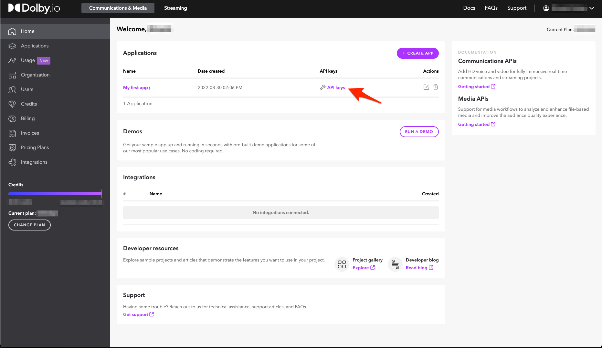
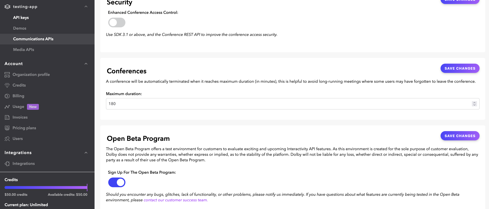
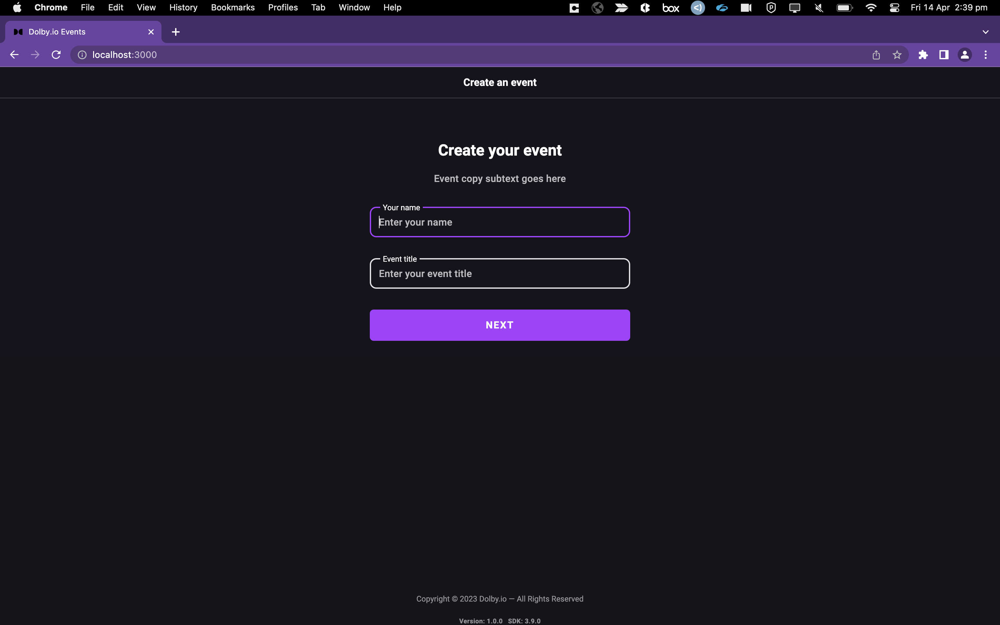

# Dolby.io Events React App

## Run the demo directly

You can experience the Dolby.io events app without needing to clone and build the app using the `Deploy to Netlify` button. You will need:

- A Netlify account to which you're logged into
- Your Dolby.io App key and secret
- [Optional] Publisher and Subcriber tokens for PubNub. This is only needed if you would like to experience chat and promoting viewers to host.

Refer to [this guide](#how-to-get-a-dolbyio-account) on how to obtain your Dolby.io tokens and [this guide from PubNub](https://www.pubnub.com/tutorials/javascript-sdk-chat-app/?step=set-up-environment) on how to obtain your PubNub tokens.

[](https://app.netlify.com/start/deploy?repository=https://github.com/dolbyio-samples/comms-app-react-events)

## Overview

This project demonstrates what an events experience is like, built using React.

<p align="center">
    
</p>

| Intended use   | Features                                | Tech stack            |
| -------------- | --------------------------------------- | --------------------- |
| Events         | create, start, stream and stop an event | Typescript/Javascript |
| Webinars       | A/V controls for hosts and viewers      | HTML/CSS              |
| Virtual events | Mute camera and microphone              | React                 |
|                | Screen share                            |                       |
|                | Invite co-hosts and viewers             |                       |
|                | Event Recording                         |                       |
|                | Participant List                        |                       |

## Requirements and supported platforms

The app currently supports

- Chrome 100+
- Edge 100+
- Safari 111+
- Firefox 16.3+

## Getting Started

The following steps will quickly get you started testing the Dolby.io Communications APIs capabilities.

### Pre-requisites

To get started building this app you will need a Dolby.io account. You will also need the following -

- [NPM v8.11 or higher](https://docs.npmjs.com/downloading-and-installing-node-js-and-npm)
- [Yarn v1.22.19](https://classic.yarnpkg.com/lang/en/docs/install/#mac-stable)
- [Node v18.0.0 or higher](https://nodejs.org/en/download)

### Basic terminology

As you browse through the source code and documents, you might come across some of these terms

- **A host** is a participant with additional permissions to manage the conference and other participants.
- **A viewer** is a participant who can only receive video and audio stream from the conference.
- A **proxy-app-server** is an intermediary API server that communicates with the Dolby.io Communications Platform in order to provide functionality such as RTS/RTMP/HLS streaming or consuming web-hook data. You can see our sample implementation [here](./api-proxy).

### How to get a Dolby.io account

To setup your Dolby.io account, go to the [Dolby.io dashboard](https://dolby.io) and register for an account. After confirming your email address, you will be logged in.

> If you did not receive a verification email, check your Spam or Junk email folders.

#### Setting up your [Dolby.io](https://dashboard.dolby.io) app

To set up your app for events, you will need to:

1. Go to the _Dashboard_, and click `add new app` if you do not have an existing app. 
2. To enable events streaming, your app should be opted into the open beta program. You can find this at the bottom of the `Communications APIs` sidebar navigation when you click on your app. 

## How to run the Events app

Run the following steps after cloning the repository to run the application locally.

### Install dependencies

**note** : This guide is written with [Yarn](https://yarnpkg.com/) in mind. We have not validated this project with other package managers.

Open a terminal window in the root directory of your project folder. Install the project's dependencies using the following command.

```bash
yarn
```

### Repo structure

The code in this repository is organised in the following way

- The `src/` directory contains all the front-end code for the events app. Within this directory
  - `hooks/` contains wrapper functions around our SDK for re-usable functionality.
  - `components/` contains UI components that encapsulate and provide functionality.
  - `utils/` provides some generic helper functions.
  - `context/` contains the React Context for the side drawer and the main component window.
- The `api-proxy/` contains the code for the proxy server.

This project is built with the [Comms UI Kit for react](https://github.com/dolbyio/comms-uikit-react) library for simplicity and re-use of standard Communications API based components.

### Set up `.env` file

Create a new file called `.env` and copy the contents of `.env.example` into it.

You will need to provide the values for `KEY` and `SECRET` from your dolby.io app. To obtain your key and secret from the Dolby.io dashboard,

1. Go to the _Dashboard_, and click on the `API Keys` next to your application.
   
2. On the next screen, copy the `App key` and `App secret` and paste them in your `.env` file against the marked variables.
   

If you want chat and the ability to promote a viewer to host, you will need to provide your `PUBNUB_PUBLISH_KEY`, `PUBNUB_SUBSCRIBE_KEY`, and `PUBNUB_SECRET_KEY` as well. To setup PubNub, please go through the [PubNub setup guide](customization.md/#enabling-chat-and-hot-swapping).

The secrets will not be exposed on the frontend.

#### Start the app

Execute the following command to run the application locally in a terminal window inside the `/events/` directory.

```bash
yarn dev
```

#### Open the app in a browser

After the appropriate message appears in the terminal window, open <http://localhost:3000> in the browser. The application will launch at this address and will look like the screenshot below.



## Making the App your own

Follow our [customization guide](./customization.md) to better understand how you can extend the app to make it your own.

## More resources

Want to experience the app without building it? Try our Virtual Events [Demo app](https://events.experience.dolby.io).

Looking for more sample apps and projects? Head to the [Dolby.io Project Gallery](https://docs.dolby.io/communications-apis/page/gallery).
